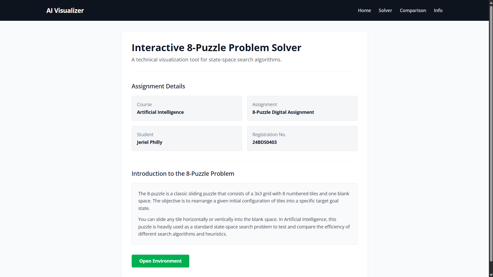
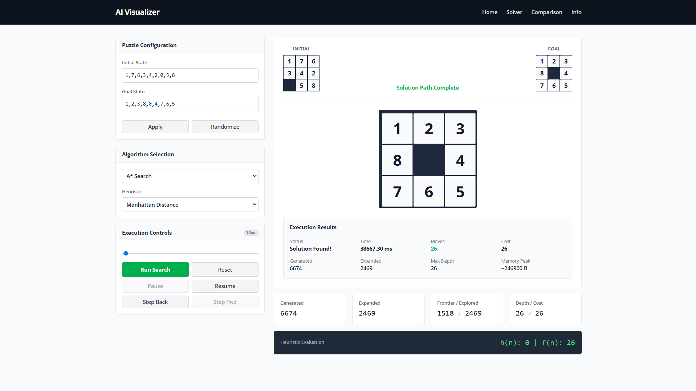
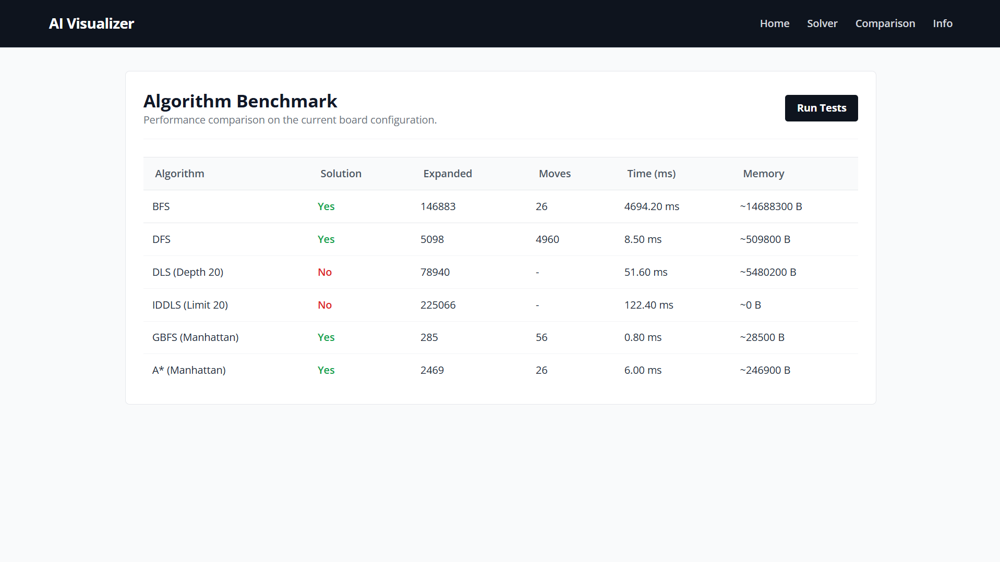
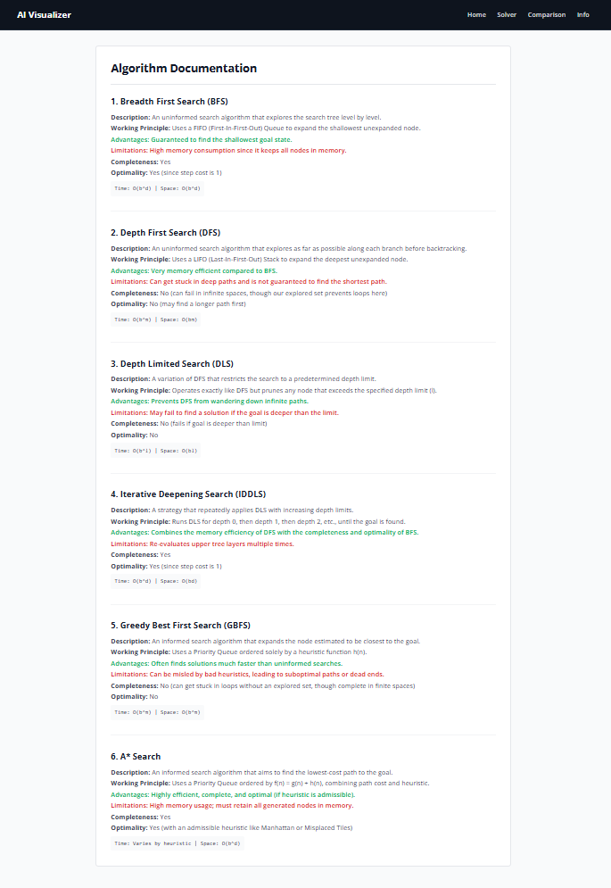

# Interactive 8-Puzzle Problem Solver

An interactive web application built to visualize and solve the classical 8-Puzzle problem using various Artificial Intelligence state-space search algorithms. This project allows users to input custom initial states, generate random solvable puzzles, and observe the search process in real-time.

## Project Description

The objective of this assignment is to understand the working of state-space search algorithms by developing an interactive web application that solves the 8-Puzzle Problem using both uninformed and informed search techniques. 

The application implements algorithms from scratch using JavaScript and visually demonstrates how each algorithm searches for the goal state. A comparison module is also included to benchmark the time, memory, and performance of all implemented algorithms.

## Technologies Used

- **HTML5** & **CSS3**
- **JavaScript (ES6)**
- **Tailwind CSS** (for styling and layout)

## Search Algorithms Implemented

### Uninformed Search Algorithms
1. **Breadth First Search (BFS):** Explores level by level. Complete and optimal.
2. **Depth First Search (DFS):** Explores depth first before backtracking. Memory efficient but not optimal.
3. **Depth Limited Search (DLS):** DFS with a strict depth boundary.
4. **Iterative Deepening Depth Limited Search (IDDLS):** Iteratively expands the depth limit. Balances BFS optimality and DFS memory efficiency.

### Informed Search Algorithms
5. **Greedy Best First Search (GBFS):** Uses heuristics to pick the node closest to the goal. Fast but not optimal.
6. **A* Search:** Combines path cost `g(n)` and heuristic `h(n)`. Optimal and complete.

## Heuristics Used

For GBFS and A*, two heuristic functions are available:
1. **Misplaced Tiles:** Counts the number of tiles that are not in their goal position.
2. **Manhattan Distance:** Calculates the sum of absolute horizontal and vertical distances of each tile from its goal position.

## Screenshots

### Home Page


### Solver Executing Search


### Algorithm Comparison Table


### Algorithm Information Page


## GitHub Pages URL

[https://jerielphilly.github.io/AI-8Puzzle-Visualizer](https://jerielphilly.github.io/AI-8Puzzle-Visualizer)

## Student Details

- **Name:** Jeriel Philly
- **Registration Number:** 24BDS0403
- **Course:** Artificial Intelligence

## How to Run the Project

Since this is a vanilla HTML/JS application with no backend dependencies, it can be run entirely in the browser.

1. Clone this repository:
```bash
git clone https://github.com/Jerielphilly/AI-8Puzzle-Visualizer.git
```
2. Open `index.html` in any modern web browser.
3. Use the navigation bar to switch between the Solver, Comparison Table, and Information pages.

## References

- Stuart Russell and Peter Norvig, *Artificial Intelligence: A Modern Approach*
- MDN Web Docs: JavaScript Generators and Iterators
